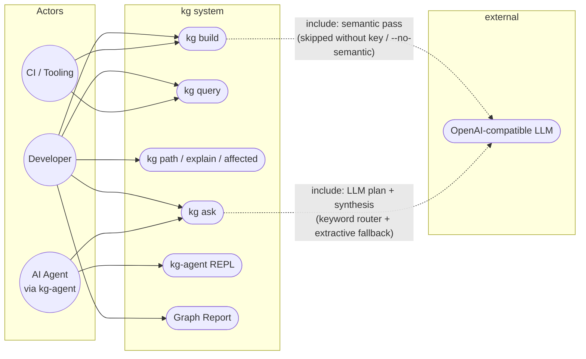

# 01 — Use-Case: Actors & Goals

## Notes

- **Developer** — the primary actor. Builds the graph once, queries it many times cheaply.
- **AI Agent** — consumes the graph programmatically; never touches the pipeline.
- **CI** — runs `kg build` on a schedule; must never need a network (hence `--no-semantic`).
- Dashed arrows are `<<include>>`: the LLM is invoked only when a key exists, and every LLM touchpoint has a deterministic fallback so no use-case *fails* offline.
