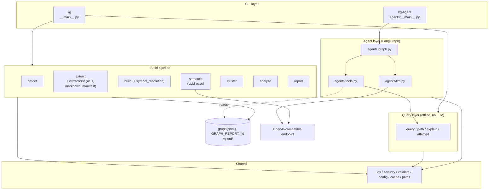

# 02 — Component: System Architecture

## Key boundaries

- **`graph.json` is the contract** between build and query/agent layers. One direction: build writes, everything else reads.
- **The only two modules that touch the network** are `semantic` (build-time) and `agents/llm` (ask-time). Everything else is local.
- `SUPPORT` modules (`ids`, `security`, `validate`, `config`, `cache`, `paths`) are dependency-free leaves; every layer imports them, they import nothing from the layers.
