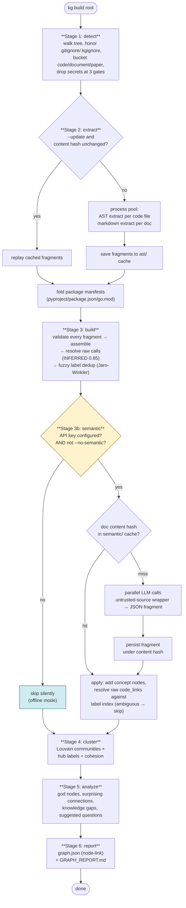

# 03 — Activity: `kg build` Workflow

Faithful to `pipeline.py`, including the cache and semantic gates.

## Points worth calling out

- **Failure isolation**: any single file/fragment failure becomes an `error`-keyed empty fragment — the run never dies.
- **Two independent caches**: `ast/` (structural, hash-keyed) and `semantic/` (LLM, content-hash-keyed). Re-runs re-bill nothing on either side.
- **The semantic gate is the only branch that can cost money**, and it is double-gated: key present AND flag not passed.
