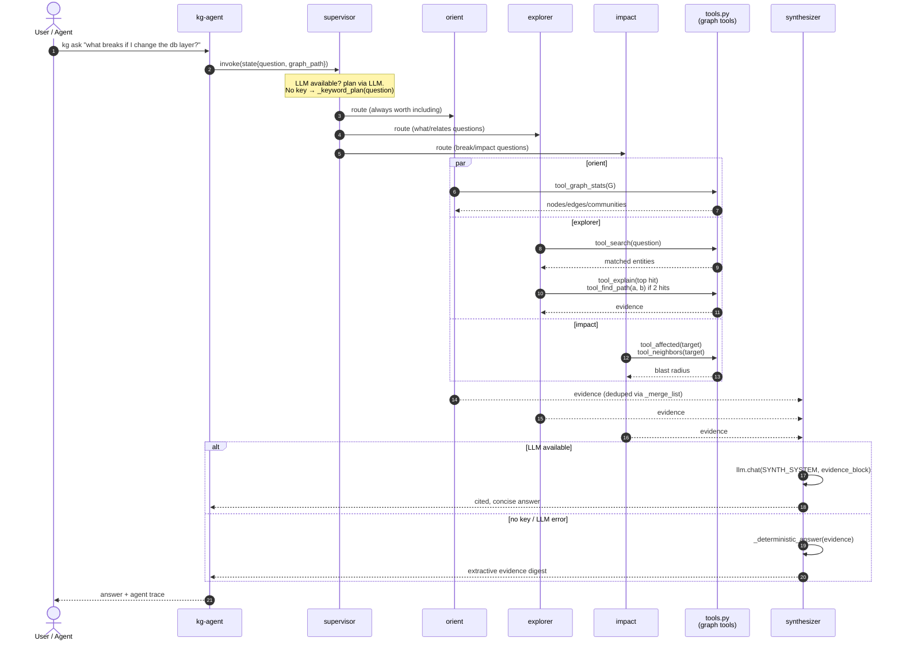

# 04 — Sequence: `kg ask` Runtime

Faithful to `agents/graph.py`. Dashed box = optional LLM path with deterministic fallback.

## Notes

- The three workers run in **parallel** (`add_conditional_edges` fan-out from supervisor) — LangGraph merges their partial state via the `_merge_list` reducer, which dedups evidence payloads.
- Evidence is capped: `_slim()` truncates list payloads to 25 items before they reach the synthesizer prompt — tool output never blows the context window.
- The `needs_more` flag exists for a second exploration hop but the current topology routes straight to synthesis; the flag is plumbed and unused by design.
