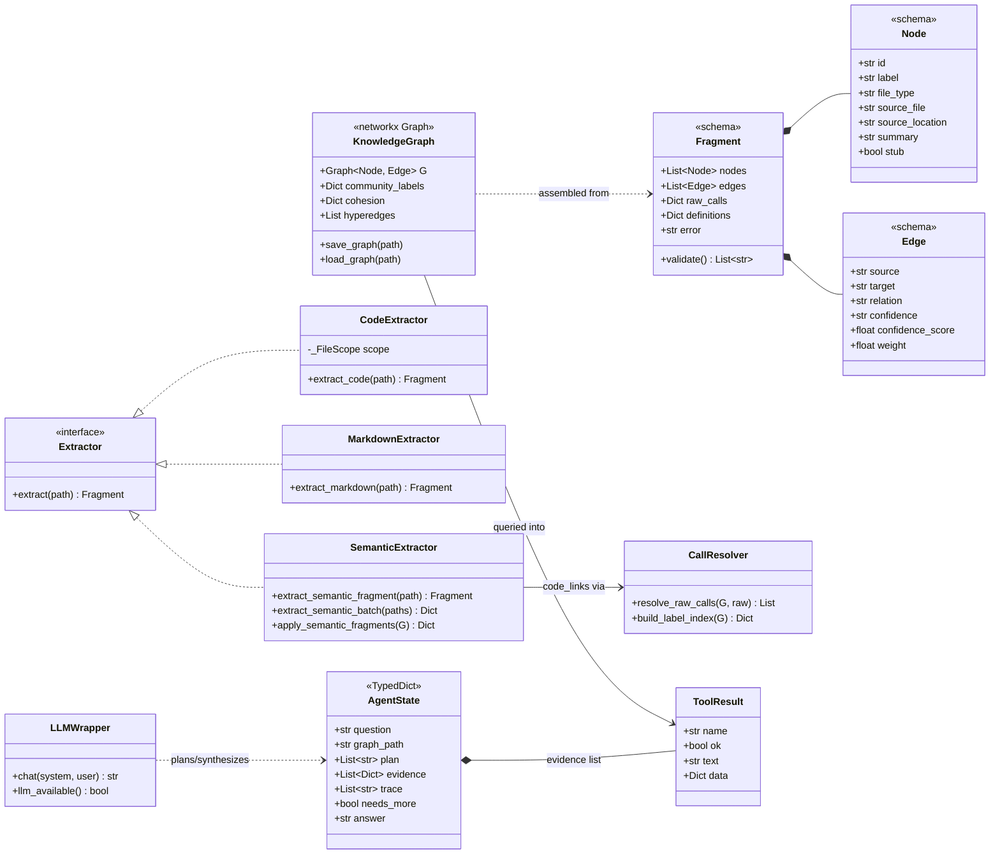

# 05 — Class: Domain Model

Core data shapes across the pipeline and agent layers.

## Schema invariants (enforced by `validate.py`)

- `file_type ∈ {code, document, paper, image, rationale, concept}`
- `confidence ∈ {EXTRACTED, INFERRED, AMBIGUOUS}`
- Every edge endpoint must resolve to a node id **within the same fragment** — which is why cross-fragment producers either emit stubs (`CodeExtractor`) or defer resolution (`SemanticExtractor.code_links`).
- IDs: one normalization recipe in `ids.py`; two producers of the same entity must converge on the same id or the graph splits into ghosts.
