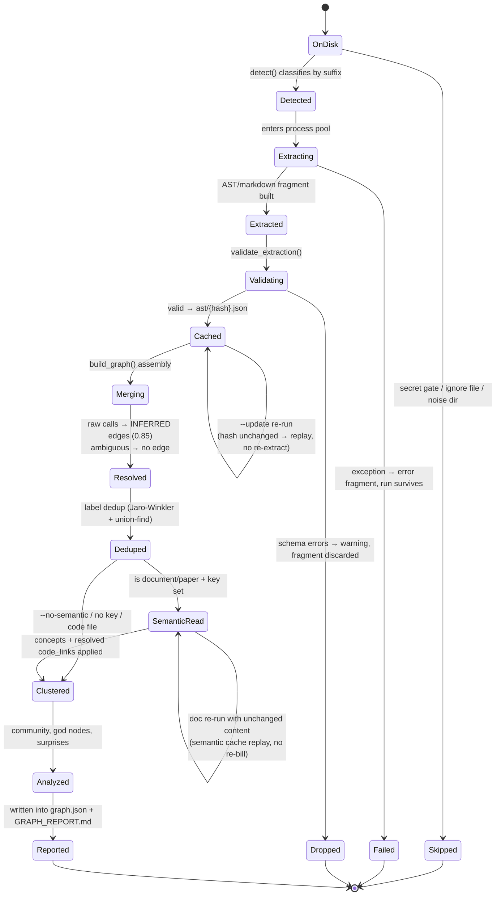

# 06 — State: A File's Journey Through the Pipeline

One source file, from disk to report.

## Why a state diagram here

A file's treatment depends on its type, its history, and two flags — a flowchart of the whole pipeline (diagram 03) shows the happy path, but this shows the **survivorship rules**: which states a file can get stuck in (`Cached`), which are terminal failures (`Skipped`, `Failed`, `Dropped`), and which loops are *free* (cache replay) versus which cost money (semantic extraction, only on content change).
