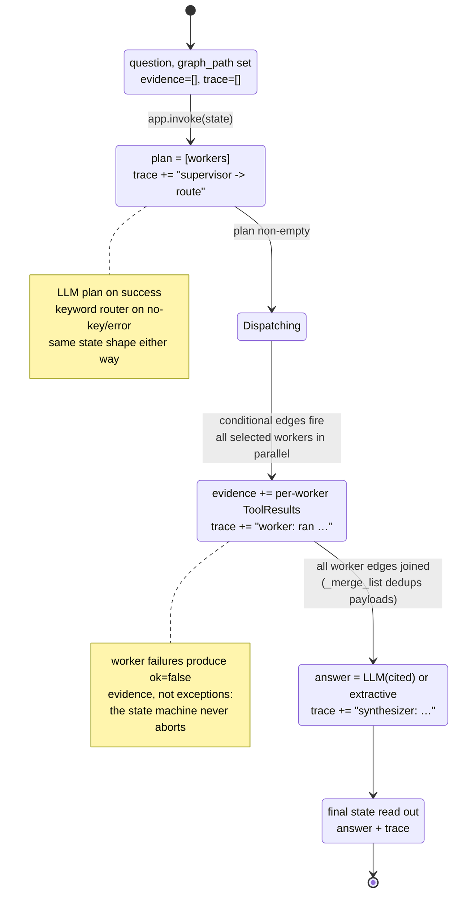

# 07 — State: AgentState Through One `kg ask` Run

The `AgentState` TypedDict is the only channel between agent nodes. This diagram
tracks *the state object*, not the agents.

## Field evolution

| Phase | `plan` | `evidence` | `answer` |
|---|---|---|---|
| Received | — | `[]` | — |
| Planning | `["orient", "explorer"]` | `[]` | — |
| Collecting | set | 1–5 entries, deduped | — |
| Synthesizing | set | set | extractive or LLM |
| Done | set | set | final string |

The invariants worth keeping when extending this: nodes are **pure functions** of state → partial state; evidence entries always carry `{tool, ok, text, data}` so the deterministic synthesizer can render them without special cases; and `trace` is append-only, which is what makes the REPL output auditable.
