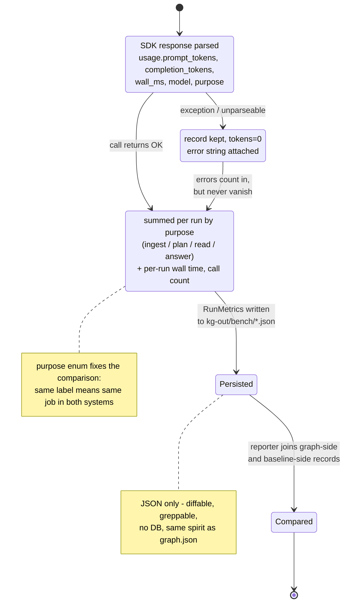

# 08 — State: Metric Record Lifecycle (supporting: benchmark)

One unit of observability — a single LLM call's token/time record — from the
moment the OpenAI SDK returns until it lands in a comparison. This is the
contract between the instrumentation (`baseline/usage.py`, `agents/llm.py`,
`semantic.py`) and the bench reporter.

## The `purpose` vocabulary (the comparison's backbone)

| purpose | baseline (ReAct) | graph system |
|---|---|---|
| `ingest` | file listing/scanning | `kg build` (detect→extract→build) |
| `plan` | agent decides next tool | supervisor routing |
| `read` | each `read_file` call | — (0: graph replaces re-reading) |
| `answer` | final synthesis call | synthesizer call |

**Why a state diagram:** records can't be allowed to silently disappear. A failed call must still be counted (cost of failure is part of the comparison), and a record that never reaches `Compared` is a bug in the harness, not a missing data point. This diagram is the acceptance test for the metrics layer.
