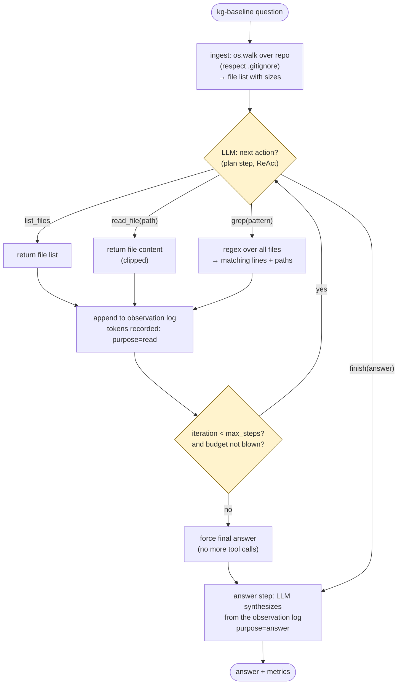

# 09 — Activity: ReAct Primitive Baseline (supporting: benchmark)

The comparison target: a competent developer with **no AST, no knowledge graph,
no index** — just filesystem tools and an LLM deciding what to do next.
Deliberately *not* strawmanned: it gets real tools and a real loop; what it
lacks is precomputed structure.

## Design rules (what makes the comparison fair)

- **No memory between questions, no index between steps.** Every fact the
  baseline knows, it re-read from the filesystem this run. This is the
  property the graph system is built to eliminate.
- **`grep` is a real tool** (it's what a developer would demand) — but note
  what it cannot do: answer "what *calls* `query_user` across files with
  confidence" without the model reasoning over raw text each time.
- **Bounded**: `max_steps` and a token budget force termination, and the
  forced-answer path still counts all spend. A runaway baseline is a *finding*,
  not a crash to be hidden.
- **Same metric contract** as the graph side (`purpose` vocabulary, diagram 08)
  — identical records, identical aggregation, so the comparison is arithmetic,
  not narrative.

## What the graph side replaces, visibly

| Baseline step | Graph-side equivalent | Difference |
|---|---|---|
| scan + read_file (repeated) | `kg build` once, cached | `read` purpose drops to ~0 at ask-time |
| grep + model reasoning over matches | `find_path` / `find_affected` | deterministic traversal, no tokens |
| plan step per hop | supervisor plans once | fewer, cheaper calls |
| answer from raw observations | answer from structured evidence | same call count, smaller prompt |
