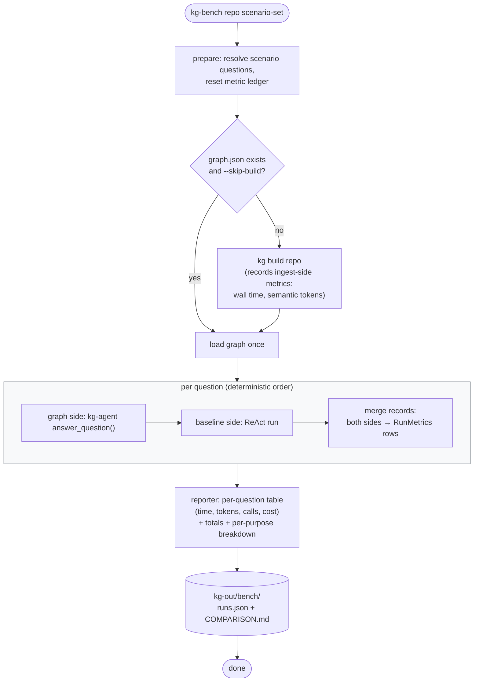

# 10 — Activity: `kg-bench` Run (supporting: benchmark)

How one comparison experiment executes end to end.

## Fairness rules baked into the flow

1. **Same questions, same order, both sides** — no cherry-picking, no warm caches carrying over between systems.
2. **Graph build cost is amortized honestly**: reported separately as `ingest`, never hidden, so the reader can compute the break-even question count themselves.
3. **Every scenario run is appended** (`runs.json` is a log, not a snapshot) — re-running the bench adds evidence rather than overwriting it.
4. **The baseline runs against the same repo state** the graph was built from — if the repo changed between build and bench, the harness warns.

## Output consumers

- `COMPARISON.md` — the human-readable verdict, generated, never hand-edited.
- `runs.json` — raw rows for anyone who wants to re-cut the numbers.
- Diagram 08's lifecycle is the contract both sides obey so the reporter stays arithmetic.
